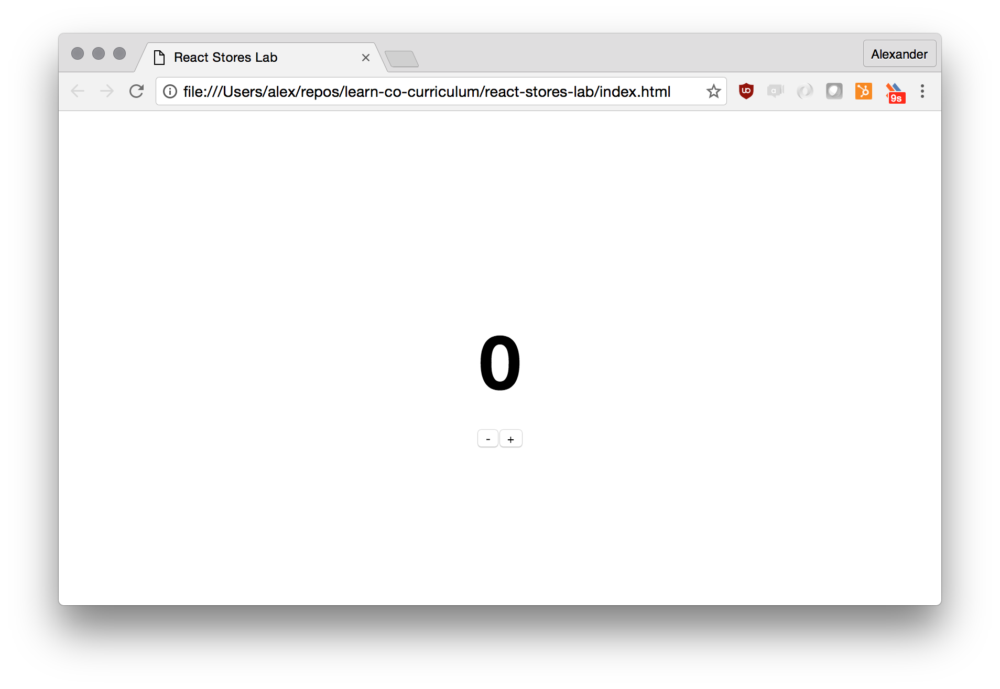

# React Stores Lab

## Overview

In this lesson we're going implement a simple counter application. Our focus will be on the stores and actions, how they interact with each other and how we can wire them up to components.

Our counter has two buttons used for incrementing and decrementing a number.
 
This is what it's going to look like:



## Directory Structure

```
components/
└── App.js
stores/
├── Store.js
└── counterStore.js
actions
└── index.js
```

Our directory structure looks rather boring this time, since we're mostly going to focus on the global store of our application.

## Components

Our application has a single component called `<App />`. `<App />` needs to be "wired" up to the `counterStore` using the component's lifecycle methods:

* `componentDidMount` is going to add an event listener to the `counterStore`. If the store is being updated, the state of our `<App />` component should be updated as well.

* `componentWillUnmount` is going to remove the event listener.

Our `<App />` component renders two buttons and the actual counter number. If we click on `+`, the counter will be incremented by `1`. If we click `-`, the counter will be decremented by `1`.

## Stores

There are two stores: `Store` and `CounterStore`. `CounterStore` inherits from `Store`. `counterStore` exports a single instance of `CounterStore`, whereas `Store` exports a class that we can inherit from in the future.

We first need to implement the `Store`'s instance methods before we can implement the `CounterStore` class.

The global application state that we're updating is a simple counter, represented by a number. The initial count will be set to `0`, which will also be the initial state of the `counterStore`.

### Actions

There are two actions: `increment()` and `decrement()`. The action creators are directly wired up to the global `counterStore` singleton.

`increment()` and `decrement()` have similar logic. They both update the `counterStore` by doing the following:

1. Both of them first have to retrieve the previous state using `store.getState()`.
2. They then add / subtract `1` from the previous state and call `store.setState(newState)`

### Stores -> Components

Our `<App />` component doesn't directly update the store, but subscribes to its updates. The store is the single source of truth of our application, but is completely decoupled from individual components. In other words, there is no way for a component to directly update a store.

### Components -> Actions -> Stores

Since a counter that doesn't change its count would be rather boring, we need to figure out a way how to allow components to update the store.

E.g. if a user clicks a button, we need to change the counter (= state of the `counterStore`).

Hence we add a specific set of actions that enables our components to update the store. Instead of updating the global application state in the component directly, we decouple the respective action by extracting it out from the component.

**Advanced** For now we're using `setState` on stores to trigger a global state change. Later on we're going to introduce a dispatcher in order to introduce an isolated event bus.

## Resources

- [React: Multiple Components](https://facebook.github.io/react/docs/multiple-components.html)
